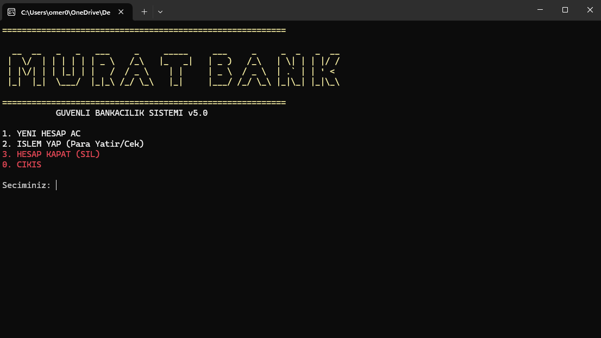
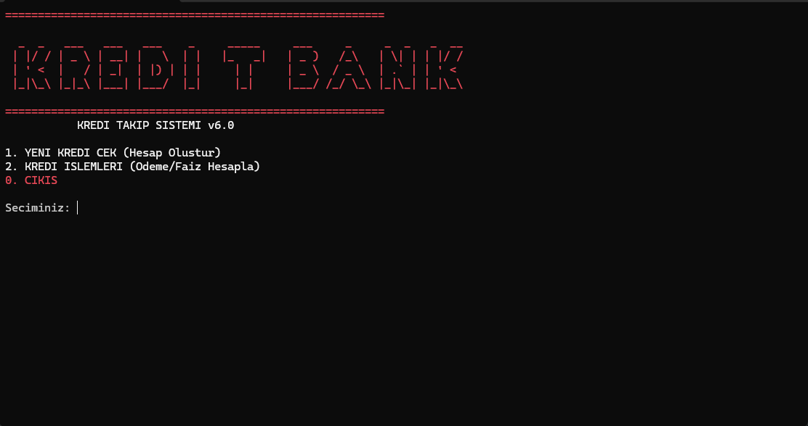

# 🏦 C++ Banking Simulations Suite


Bu depo, Nesne Yönelimli Programlama (OOP) prensipleri kullanılarak geliştirilmiş iki farklı finansal simülasyon projesini içerir.

## 📂 Projeler

### 1. 💰 Banka Hesap Simülasyonu (V5.0)
Klasik bankacılık işlemlerini simüle eden sistem.
 Özellikler Rastgele hesap no, Para yatırmaçekme, Bakiye kontrolü.
 Teknik `Inheritance`, `Polymorphism`, Akıllı sayı girişi (100.000 gibi).
 Konum `Banka-Hesap-Simulasyonumain.cpp`



### 2. 💳 Kredi & Faiz Hesaplama Sistemi (V6.0)
Gelişmiş kredi, faiz ve vergi hesaplama motoru.
 Özellikler Gecikme faizi hesaplama, BSVMKKDF vergi hesabı, Kredi takibi.
 Senaryo Ödeme zamanında yapılırsa %3.5, gecikirse %3.8 faiz + %40 vergi uygular.
 Konum `Kredi-Hesap-Sistemimain.cpp`



## 🚀 Nasıl Çalıştırılır

1. İlgili klasördeki `.cpp` dosyasını Visual Studio veya herhangi bir C++ derleyicisi ile açın.
2. `CTRL + F5` ile derleyip çalıştırın.
3. Türkçe karakter desteği (UTF-8) ve renkli terminal arayüzü otomatik yüklenir.

Repoyu Klonla:
``` bash
https://github.com/Omer-Murat/Banking-Credit-Suite
```

---
Geliştirici Ömer Murat
